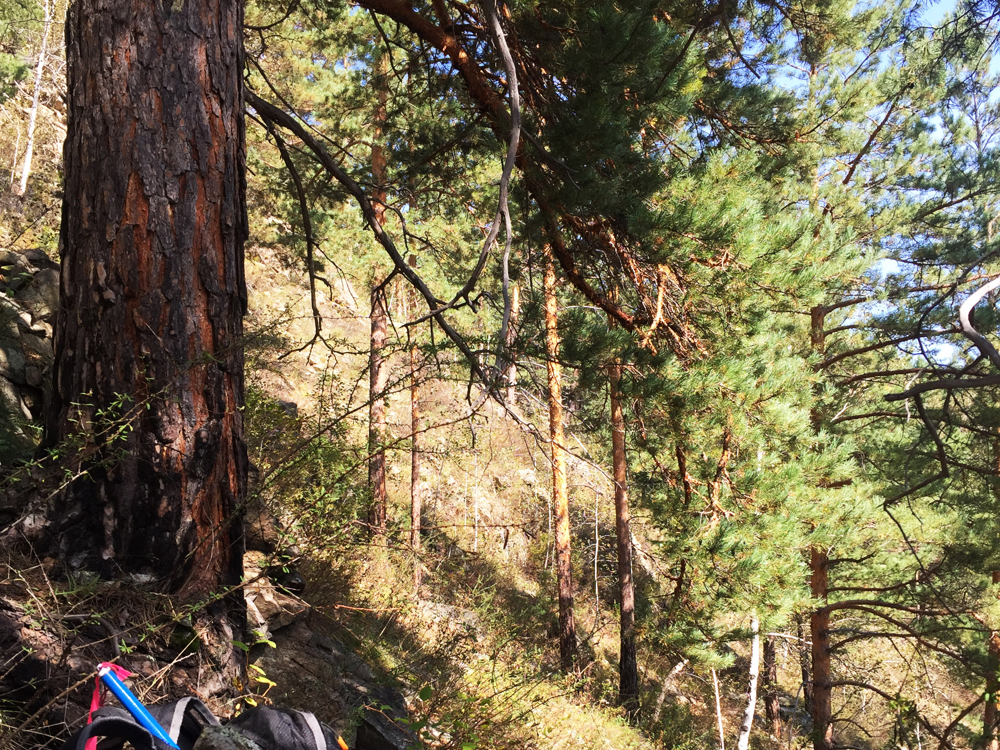
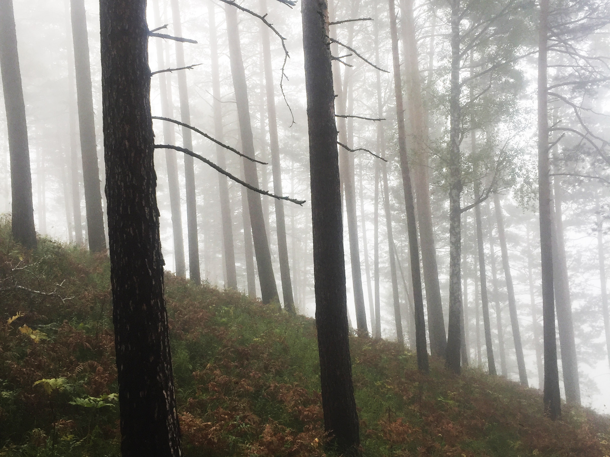

As now, the project developed a network of precipitation sensitive tree rings along the upper reaches of Yenisei River.
The new tree-rig data dated to 2019 update and extend the historical network of tree-ring width chronologies in his region. Additionally, we developed a set of pseudo tree-ring records via VS-forward simulation. This new tree-ring dataset will be incorporated into TRISH- tool database.

Large stone of the Great Salbyk kurgan. The area of tree-ring
sampling has richest archaeological heritage in Siberia. Many
kurgan fields burials have well-preserved timbers inside burials
suitable for tree-ring analysis.

Sampling on extremely steep slopes ensures the hydrological
signal In tree-ring width variance. Growth conditions is very
dry on these slopes. However, frequent fires

Sayano-Shushenskaya Dam, 242 m high, on the Yenisei River in
Khakassia, Russia. This the largest power plant in Russia holds
the 9th place among largest hydroelectric plant in the world.
The dam impacts the natural river flow since 1963. Simulation of

Larch and pine trees sampled in the vicinity of the
Sayano-Shushenskaya Dam in Fall 2019. We search for old-growth
trees on steep slopes in forest-steppe ecotones. Growth of
oldest trees reaches the age of up to 400–430 years, but these
trees are rare and hard to find.
